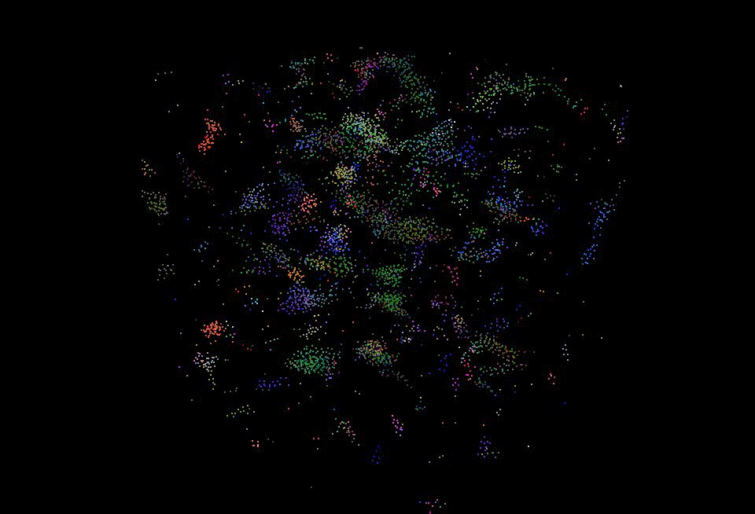

**University of Pennsylvania, CIS 565: GPU Programming and Architecture,
Project 1 - Flocking**

* Yuru Wang
* Tested on: Windows 10, i7-7700HQ @ 2.5GHz 128GB, GTX 1050 Ti 8GB (personal computer)
* Modified CMakeList.txt: changed sm_20 to sm_60 inside cuda_add_library

### Result
**Naive Implementation**

**Uniform Grid Implementation**

### Performance Testing

### Questions
#### For each implementation, how does changing the number of boids affect performance? Why do you think this is?
As the diagram indicates, for all three implementations, increasing the number of boids would decrease the FPS.As more boids are added to the scene, for each boid, the number of its neighbor boids would also increase, which requires more computing time for calculating its new velocity.

#### For each implementation, how does changing the block count and block size affect performance? Why do you think this is?
From the char we can see that, for naive implementation, as the block size increase, the performance is also increased. However for the uniform grid implementation, the performance is improved as the block size increasing at the beginning, then the fps reaches a peak and start to drop. So I think there exists a best block size for every GPU hardware configuration. If the block size is too small, the number of threads in one block would be too small or even less than the number of threads one warp has. Since SM process one warp of one block at a time, if the number of threads one block is very small, it would be a waste of SM’s processing power. Meanwhile, if the block size is too large, one block would have multiple warps of threads, which would require more time for SM to deal with.

#### For the coherent uniform grid: did you experience any performance improvements with the more coherent uniform grid? Was this the outcome you expected? Why or why not?
The performance of coherent uniform grid is better than scattered one’s as observed from the diagram. This is the expected outcome because for the scattered uniform grid implementation, the pointers to the boid position and velocity data are sorted by the grid indices, but those pointers are referring to discontinuous memory location. While for the coherent uniform grid implementation, the position and velocity data are sort directly and then resides on continuous memory location, which increase the memory accessing speed.

#### Did changing cell width and checking 27 vs 8 neighboring cells affect performance? Why or why not? Be careful: it is insufficient (and possibly incorrect) to say that 27-cell is slower simply because there are more cells to check!
Changing the cell width did affect the performance. Setting the cell width as twice the neighboring distance means we only need to check at most 8 neighboring cells, while setting the cell width equals to the neighboring distance, we need to check all surrounding 27 cells to make sure all possible influencing boids are checked. Event though the 27 cells means more looping than 8 cells, but we need to notice that the volume the neighboring cells occupied are different as well. When the number of boids are large, checking 27 cells actually checks less boids than with 8 cells, which gives better performance.
